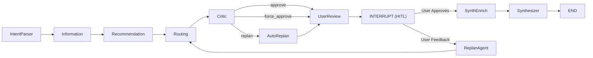

# TravelCrew: Multi-Agent Collaborative Travel Planning

> An AI-powered travel planning system built on LangGraph — where 8 specialized agents collaborate to craft your perfect itinerary, with real-time data, human-in-the-loop feedback, autonomous replan via tool-use agent, and streaming report generation.

<p align="center">
  <em>Multi-Agent · ReplanAgent Tool-Use Loop · Human-in-the-Loop · SSE Streaming · Anti-Hallucination · Multi-Currency</em>
</p>

---

## Table of Contents

- [Overview](#overview)
- [From Query to Report: The Complete Pipeline](#from-query-to-report-the-complete-pipeline)
- [ReplanAgent: Autonomous Itinerary Revision](#replanagent-autonomous-itinerary-revision)
- [Key Features](#key-features)
- [Multi-Agent Architecture](#multi-agent-architecture)
- [Project Structure](#project-structure)
- [Deployment Guide](#deployment-guide)
- [Web Interface](#web-interface)
- [API Endpoints](#api-endpoints)
- [Configuration](#configuration)
- [Tech Stack](#tech-stack)
- [License](#license)

---

## Overview

**TravelCrew** is a multi-agent collaborative travel planning system built on [LangGraph](https://github.com/langchain-ai/langgraph). Instead of a single monolithic LLM call, the system decomposes travel planning into a pipeline of **8 specialized agents**, each responsible for a distinct phase — from parsing user intent, through fetching real-time data, generating recommendations, quality auditing, all the way to producing a beautifully formatted travel report with streaming progress.

When the Critic agent detects quality issues or the user provides feedback, a powerful **ReplanAgent** kicks in — an autonomous tool-use agent that can inspect the plan, search for new POIs via Google Places, swap attractions, update preferences, and verify constraints, all in an iterative loop until the itinerary is perfect.

---

## From Query to Report: The Complete Pipeline

The system transforms a natural-language travel request into a comprehensive, beautifully formatted Markdown report through a carefully orchestrated multi-stage pipeline. Here's the complete journey:

### Stage 1: Intent Parsing & Data Collection

```
User Query (natural language)
    │
    ▼
┌──────────────────┐
│  IntentParser    │  LLM extracts: destination, duration, budget (auto currency→USD),
│                  │  pacing, dietary prefs, group type, must-visit places, interests
└────────┬─────────┘
         │
         ▼
┌──────────────────┐
│  Information     │  4 external APIs in parallel (ThreadPoolExecutor):
│                  │  • Google Places (AI Mode + Text Search + Nearby Search)
│                  │  • Google Weather (forecasts + severe alerts)
│                  │  • Hotel search (filtered by per-night budget)
│                  │  • Wikivoyage (customs, safety, transport tips)
└────────┬─────────┘
         │
         ▼
  raw_knowledge: {pois[], weather, hotels[], wikivoyage{}}
```

### Stage 2: Recommendation & Quality Audit

```
raw_knowledge
    │
    ▼
┌──────────────────┐
│  Recommendation  │  Two-phase recommendation:
│                  │  Phase 1: Rule-based pre-filtering (weather, budget, must-avoid)
│                  │  Phase 2: LLM daily-structured scoring (theme 40%, budget 30%,
│                  │          rating 20%, time 10%) + anti-hallucination filter
└────────┬─────────┘
         │
         ▼
┌──────────────────┐
│  Routing         │  Coordinate backfill + transport matrix (Google Distance Matrix)
│                  │  + restore website/maps_url fields
└────────┬─────────┘
         │
         ▼
┌──────────────────┐
│  Critic          │  11-rule quality audit:
│                  │  budget, weather, time, theme, rating, meals, structure,
│                  │  category separation, must-visit coverage, transit, hotel
└────────┬─────────┘
         │
    ┌────┴─────┬────────────┐
    │          │            │
 approve   replan    force_approve
    │          │            │
    │          ▼            │
    │   ┌────────────┐      │
    │   │ AutoReplan │      │
    │   │(ReplanAgent│      │
    │   │ tool-use   │      │
    │   │  loop)     │      │
    │   └─────┬──────┘      │
    │         │             │
    └────┬────┘─────────────┘
         │
         ▼
┌──────────────────┐
│  UserReview      │  Pre-compute display fields:
│                  │  currency, symbol, exchange rate, language detection,
│                  │  batch-translate POI names to Chinese (if needed)
└────────┬─────────┘
         │
         ▼
   ╔═══════════════╗
   ║  INTERRUPT    ║  Human-in-the-Loop pause point
   ║ (SynthEnrich) ║  User reviews itinerary, provides feedback or approves
   ╚═══════════════╝
```

### Stage 3: Human-in-the-Loop Feedback Loop

At the interrupt point, the user sees a day-by-day itinerary review screen. The feedback cycle works as follows:

1. **User provides feedback** (e.g., "把第二天的博物馆换成购物中心")
2. **ReplanAgent** runs autonomously (up to 20 tool-call iterations):
   - Inspects current plan → searches for new POIs → modifies itinerary → checks constraints → finalizes
3. **Modified itinerary** is injected into the graph state
4. **Graph re-streams** through Routing → Critic (force-approve) → UserReview → INTERRUPT again
5. **Repeat** until the user is satisfied (empty input = approve)

### Stage 4: Report Generation

```
User confirms → resume graph
    │
    ▼
┌──────────────────┐
│  SynthEnrich     │  Enrich itinerary with:
│                  │  • POI cover images (Serper.dev, geographic disambiguation)
│                  │  • Static route maps (Google Static Maps, cached locally)
│                  │  • POI name translations
└────────┬─────────┘
         │
         ▼
┌──────────────────┐
│  Synthesizer     │  Assemble all data into a 9-section Markdown report:
│                  │  1. Trip Overview  2. Pre-Trip Prep  3. Accommodation
│                  │  4. Daily Itinerary  5. Food Guide  6. Experiences
│                  │  7. Safety Guide  8. Alternatives  9. Summary
│                  │  • Streaming output via SSE (token-by-token)
│                  │  • Anti-hallucination: price backfill, data-source constraints
└────────┬─────────┘
         │
         ▼
   final_itinerary (Markdown report)
```

---

## ReplanAgent: Autonomous Itinerary Revision

The **ReplanAgent** is the system's most powerful component — a fully autonomous tool-use agent that replaces traditional single-LLM-call replanning. Instead of generating a text instruction and hoping the Recommendation node follows it, the ReplanAgent directly manipulates the itinerary through an iterative tool-use loop.

### Architecture

```
User Feedback + Current State
       │
       ▼
┌─────────────────────┐
│   ReplanAgent.run() │
│                     │
│  ┌── LLM ◄──────┐   │
│  │   │          │   │
│  │   ▼          │   │
│  │ Tool Call    │   │
│  │   │          │   │
│  │   ▼          │   │
│  │ Execute Tool │   │
│  │   │          │   │
│  └──►Result ────┘   │
│      (loop until    │
│       finalize)     │
└─────────────────────┘
       │
       ▼
Modified itinerary + prefs + new POIs
```

### Available Tools (12 tools)

| Tool | Purpose |
|------|---------|
| `get_current_plan` | View the full itinerary, preferences, budget, and geographic clusters |
| `get_poi_pool` | Browse available attractions, restaurants, and hotels |
| `search_place` | Search Google Places for specific places (adds to POI pool) |
| `search_hotel` | Search hotels with price range filters |
| `check_weather` | View weather forecast and alerts |
| `get_destination_info` | Read Wikivoyage travel knowledge |
| `discover_places` | AI-powered place discovery via SerpApi AI Mode |
| `check_transit` | Query the pre-computed transport matrix |
| `modify_plan` | Add/remove/swap attractions, dining, hotels; reorder |
| `check_constraints` | Validate budget, structure, must-visit coverage |
| `update_preferences` | Modify user preferences (dietary, pacing, interests, etc.) |
| `finalize` | Signal completion with a change summary |

### Smart Execution Strategies

- **Parallel read-only tools**: Search and inspect calls run concurrently (up to 6 workers) for 2-3x speedup
- **Search-loop detection**: If the agent makes 5+ search calls without modifying, a warning is injected to force action
- **Iteration budgeting**: Urgency warnings at `max_iterations - 3`, forced finalize at `max_iterations - 1`
- **Budget rebalancing**: The agent detects budget surplus and proactively upgrades dining/attractions
- **Geographic awareness**: Pre-computed cluster data prevents mixing distant POIs into the same day

### Why ReplanAgent Beats Single-LLM Replanning

| Aspect | Single LLM Call | ReplanAgent |
|--------|----------------|-------------|
| POI discovery | Cannot search new POIs | Searches Google Places in real-time |
| Verification | No self-check | Runs `check_constraints` before finalizing |
| Iterations | One-shot (may miss issues) | Up to 20 iterative refinement rounds |
| Scope control | May change unrelated items | System prompt enforces targeted fixes only |
| Budget awareness | No budget feedback | Detects surplus/deficit and rebalances |
| Hotel search | Fixed hotel pool | Searches hotels with price range filters |

---

## Key Features

### Real-Time External Data
No hallucinated data — every POI, hotel, weather forecast, and travel tip comes from real APIs:
- **Google Places API** — attractions, restaurants, hotels (parallel search with AI Mode enhancement)
- **Google Distance Matrix API** — inter-attraction transit times
- **Google Geocoding API** — coordinate backfill for POIs
- **Google Weather API** — multi-day forecasts and severe weather alerts
- **Wikivoyage API** — destination-level travel knowledge (customs, safety, transport tips)
- **SerpApi** — Google AI Mode search for must-visit place discovery
- **Serper.dev** — Google Images search for POI cover images

### Anti-Hallucination Safeguards
Three layers of protection ensure report accuracy:
1. **POI Verification** — the Recommendation agent strips any LLM-fabricated POIs not present in the real API data pool
2. **Price Backfill** — the Synthesizer enforces pre-computed prices from API data; no invented costs
3. **Data-Source Constraints** — the LLM prompt restricts output to only facts present in the provided data

### Streaming Report Generation
The Synthesizer streams the final Markdown report token-by-token via SSE. The frontend renders the report incrementally with:
- Zero-flicker incremental DOM updates (only the report body is re-rendered)
- Automatic scroll-to-bottom as content grows
- Real-time character count display

### Smart Budget Management
- Automatic currency detection from the user's query or destination
- Live exchange rate fetching (with static fallback rates for 6 currencies)
- Per-day budget breakdown: tickets, dining, transit, accommodation
- Destination-specific cost multipliers (50+ cities) and transit cost estimation

### Parallel API Execution
POI search uses three-level parallelization for maximum throughput:
1. **Stage 1**: AI Mode search + Geocoding run concurrently
2. **Stage 2a**: Text Search queries for all AI-discovered places in parallel
3. **Stage 2b**: Nearby Search by category (attractions, restaurants, etc.) in parallel

---

## Multi-Agent Architecture

The system is orchestrated as a LangGraph state machine with conditional edges enabling the replan loop and a human-in-the-loop interrupt point.

### Workflow Diagram



### Agent Roles

| # | Agent | Role |
|---|-------|------|
| 1 | **IntentParser** | Parses natural language into structured intent (destination, dates, budget, prefs) |
| 2 | **Information** | Fetches real-time data from 4 APIs in parallel (POIs, weather, hotels, Wikivoyage) |
| 3 | **Recommendation** | Two-phase: rule-based pre-filtering + LLM daily-structured scoring |
| 4 | **Routing** | Transport matrix, coordinate backfill, field restoration |
| 5 | **Critic** | 11-rule quality audit; triggers AutoReplan when issues found |
| 6 | **AutoReplan** | Runs the ReplanAgent tool-use loop to fix critic-identified issues |
| 7 | **UserReview** | Pre-computes display fields, batch-translates POI names |
| 8 | **SynthEnrich** | Enriches with images, static maps, translations |
| 9 | **Synthesizer** | Generates 9-section Markdown report with streaming output |

### Shared State (TravelState)

All agents communicate through a central `TravelState` TypedDict:

```
query --> IntentParser --> intent, user_preferences
intent --> Information --> raw_knowledge (weather, pois, hotels, wikivoyage)
raw_knowledge --> Recommendation --> recommended_pois, daily_itinerary
daily_itinerary --> UserReview --> display_currency, exchange_rate, is_chinese
recommended_pois --> Routing --> routing_metrics, transport_matrix
routing_metrics --> Critic --> audit_findings, replan_count
daily_itinerary --> SynthEnrich --> enriched itinerary (images, maps)
enriched itinerary --> Synthesizer --> final_itinerary (Markdown report)
```

---

## Project Structure

```
TravelCrew/
├── main.py                          # CLI entry point (interactive terminal mode)
├── requirements.txt                 # Python dependencies
├── package.json                     # Tailwind CSS build config (optional)
├── .env.example                     # Environment variable template
├── LICENSE                          # MIT License
│
├── src/                             # Core application logic
│   ├── graph.py                     # LangGraph workflow definition & compilation
│   ├── state.py                     # TravelState TypedDict (shared state schema)
│   ├── config.py                    # Centralized configuration (LLM, API keys, constants)
│   ├── llm.py                       # LLM client (DeepSeek via OpenAI-compatible SDK)
│   │
│   ├── agents/                      # Agent node implementations
│   │   ├── intent_parser.py         # IntentParser -- parse user query into structured intent
│   │   ├── information.py           # Information -- parallel API data fetching
│   │   ├── recommendation.py        # Recommendation -- LLM-driven itinerary generation
│   │   ├── user_review.py           # UserReview -- pre-compute display fields for HITL
│   │   ├── routing.py               # Routing -- transport matrix & coordinate backfill
│   │   ├── critic.py                # Critic -- 11-rule quality audit & replan trigger
│   │   ├── synthesizer.py           # SynthEnrich + Synthesizer -- enrichment & report generation
│   │   ├── auto_replan.py           # AutoReplan -- critic-triggered autonomous replan
│   │   ├── replan_agent.py          # ReplanAgent -- tool-use agent for itinerary revision
│   │   └── utils.py                 # Shared helpers (LLM client, progress, currency)
│   │
│   └── api/                         # External API client modules
│       ├── base.py                  # Base HTTP client with retry logic
│       ├── ai_search.py             # SerpApi Google AI Mode search
│       ├── attractions.py           # Google Places POI search (parallel 3-stage)
│       ├── hotels.py                # Hotel search API
│       ├── images.py                # Serper.dev image search (3-tier fallback)
│       ├── transport.py             # Google Distance Matrix API
│       ├── geocoding.py             # Google Geocoding API (coordinate backfill)
│       ├── static_map.py            # Google Static Maps generation & caching
│       ├── weather.py               # Google Weather API integration
│       └── wikivoyage.py            # Wikivoyage / Wikimedia Enterprise API
│
├── server/                          # FastAPI web server
│   ├── app.py                       # FastAPI application & API endpoints
│   ├── schemas.py                   # Pydantic request/response models
│   ├── session_manager.py           # Session lifecycle management (TTL, concurrency)
│   └── streaming.py                 # SSE streaming with cross-thread context propagation
│
├── frontend/                        # Pure HTML/JS/CSS single-page application
│   ├── index.html                   # Main HTML page
│   ├── css/style.css                # Application styles
│   └── js/
│       ├── app.js                   # Main application logic & state machine
│       ├── api.js                   # API client functions
│       ├── components.js            # UI component renderers
│       ├── sse.js                   # SSE event handler
│       └── i18n.js                  # Internationalization (Chinese/English)
│
├── reports/                         # Generated reports (persisted .md & .html)
├── log/                             # Per-session activity logs
└── output/                          # CLI mode generated reports
```

---

## Deployment Guide

### Prerequisites

- **Python 3.10+** (recommended: 3.12 or 3.13)
- **Node.js 18+** (optional, only for Tailwind CSS rebuilds)
- **API Keys** (see [.env.example](.env.example)):
  - DeepSeek API key (LLM backend) — **required**
  - Google Maps API key (Places, Distance Matrix, Geocoding, Weather, Static Maps) — **required**
  - SerpApi key (AI Mode search) — optional
  - Serper.dev key (image search) — optional
  - OpenWeatherMap key (fallback weather) — optional
  - Wikimedia Enterprise (Wikivoyage articles) — optional

### Step-by-Step Setup on a New Machine

```bash
# 1. Clone the repository
git clone <your-repo-url>
cd TravelCrew

# 2. Create and activate a Python virtual environment
python -m venv venv
source venv/bin/activate   # macOS/Linux
# venv\Scripts\activate    # Windows

# 3. Install Python dependencies
pip install -r requirements.txt

# 4. Configure environment variables
cp .env.example .env
# Edit .env with your actual API keys:
#   - DEEPSEEK_API_KEY (required)
#   - GOOGLE_MAPS_API_KEY (required)
#   - SERPAPI_KEY, SERPER_API_KEY, etc. (optional)

# 5. (Optional) Install Node.js dependencies for Tailwind CSS rebuilds
npm install

# 6. (Optional) Rebuild Tailwind CSS if you modified frontend styles
npm run build:css
```

### Running the Application

#### Web Mode (Recommended)

```bash
python -m uvicorn server.app:app --host 0.0.0.0 --port 8000
```

Open **http://localhost:8000** in your browser.

#### CLI Mode (Interactive Terminal)

```bash
python main.py
```

### Production Deployment Tips

- **Reverse Proxy**: Use Nginx or Caddy to proxy requests to `localhost:8000` with HTTPS
- **Process Manager**: Run with `gunicorn` or `uvicorn --workers 4` for multi-process serving
- **Environment**: Set `SESSION_TTL_SECONDS` and `MAX_CONCURRENT_SESSIONS` based on expected load
- **Static Files**: The frontend is served directly by FastAPI — no separate web server needed
- **Reports**: Generated reports are persisted in `reports/` as `.md` and standalone `.html` files
- **Logs**: Per-session activity logs are saved in `log/{session_id}.log` for debugging

### Verifying the Setup

After starting the server, verify everything works:

```bash
# Health check
curl http://localhost:8000/health
# Expected: {"status":"ok","service":"travel-planning-agent"}

# Create a session and submit a query via the web UI at http://localhost:8000
```

---

## Web Interface

The web frontend is a lightweight single-page application (pure HTML/JS/CSS — no build step required):

| Feature | Description |
|---|---|
| **Natural Language Input** | Describe your trip in plain Chinese or English |
| **Real-Time Progress** | SSE streaming with live progress bar, elapsed timer, and node-by-node status |
| **Streaming Report** | Watch the Markdown report generate in real-time with incremental rendering |
| **Itinerary Preview** | Day-by-day breakdown with currency-converted costs |
| **Feedback & Revision** | Submit modifications; the ReplanAgent autonomously revises the plan |
| **Report Download** | Export the report as PDF via browser print or server-side WeasyPrint |
| **Share Link** | Generate a standalone HTML share link (`/share/{session_id}`) |
| **Language Toggle** | Switch between Chinese and English (persisted in localStorage) |
| **Collapsible Maps** | Google Static Maps are collapsed by default, expanded for printing |

---

## API Endpoints

| Method | Endpoint | Description |
|--------|----------|-------------|
| `GET` | `/health` | Health check |
| `POST` | `/api/sessions` | Create a new planning session |
| `POST` | `/api/sessions/{id}/plan` | Submit a travel query (Phase 1) |
| `GET` | `/api/sessions/{id}/stream` | **SSE** — real-time event streaming |
| `GET` | `/api/sessions/{id}/state` | Current session state snapshot |
| `POST` | `/api/sessions/{id}/feedback` | Submit feedback → triggers ReplanAgent |
| `POST` | `/api/sessions/{id}/confirm` | Confirm plan and start Phase 2 |
| `GET` | `/api/sessions/{id}/report` | Get the final report (Markdown) |
| `GET` | `/api/sessions/{id}/download` | Download report as PDF |
| `GET` | `/share/{id}` | View shareable HTML report |

### SSE Event Types

| Event | Description |
|---|---|
| `node_completed` | A graph node finished execution |
| `progress_log` | Localized progress message from a node |
| `interrupt` | Graph paused at HITL checkpoint (includes display data) |
| `markdown_chunk` | Streaming Markdown token from Synthesizer |
| `execution_complete` | Graph completed (includes final report) |
| `error` | An error occurred |
| `timeout` | Stream timed out |

---

## Configuration

All configuration is centralized in `src/config.py` and loaded from environment variables. See [.env.example](.env.example) for the full list.

### LLM Configuration

| Variable | Default | Description |
|----------|---------|-------------|
| `DEEPSEEK_API_KEY` | *(empty)* | DeepSeek API key |
| `DEEPSEEK_BASE_URL` | `https://api.deepseek.com` | LLM API base URL |
| `DEEPSEEK_MODEL` | `deepseek-v4-flash` | Model identifier |
| `LLM_TIMEOUT` | `300.0` | Per-request timeout (seconds) |
| `LLM_MAX_RETRIES` | `3` | Max retry attempts |

### External API Keys

| Variable | Description |
|----------|-------------|
| `GOOGLE_MAPS_API_KEY` | Google Places, Distance Matrix, Geocoding, Weather, Static Maps |
| `SERPAPI_KEY` | SerpApi Google AI Mode search |
| `SERPER_API_KEY` | Serper.dev Google Images search |
| `OPENWEATHER_API_KEY` | OpenWeatherMap (optional fallback) |

### Business Logic

| Variable | Default | Description |
|----------|---------|-------------|
| `MAX_REPLAN_ATTEMPTS` | `3` | Max Critic-triggered auto-replans |
| `PLACES_SEARCH_RADIUS` | `5000` | Google Places search radius (meters) |
| `PLACES_RESULT_LIMIT` | `30` | Max POI results per query |

### Web Server

| Variable | Default | Description |
|----------|---------|-------------|
| `API_HOST` | `0.0.0.0` | FastAPI bind address |
| `API_PORT` | `8000` | FastAPI port |
| `SESSION_TTL_SECONDS` | `3600` | Session time-to-live |
| `MAX_CONCURRENT_SESSIONS` | `10` | Max concurrent sessions |

---

## Tech Stack

### Backend

| Technology | Purpose |
|---|---|
| Python 3.10+ | Core language |
| LangGraph | Multi-agent state machine orchestration & checkpointing |
| DeepSeek | LLM inference via OpenAI-compatible SDK |
| FastAPI | Web API framework & SSE streaming |
| Uvicorn | ASGI server |
| Pydantic | Request/response validation |
| WeasyPrint | Server-side PDF generation |

### External APIs

| API | Purpose |
|---|---|
| Google Places API | Attractions, restaurants, hotels |
| Google Distance Matrix API | Transit time estimation |
| Google Geocoding API | Coordinate backfill |
| Google Weather API | Forecasts & severe weather alerts |
| Google Static Maps | Route visualization maps |
| SerpApi | AI Mode search for must-visit discovery |
| Serper.dev | Google Images search |
| Wikivoyage / Wikimedia | Destination travel knowledge |

### Frontend

| Technology | Purpose |
|---|---|
| HTML5 + Vanilla JS (ES Modules) | SPA without build tools |
| CSS3 | Responsive styling with gradient animations |
| Server-Sent Events (SSE) | Real-time progress & streaming report |
| marked.js (v4.3.0) | Client-side Markdown rendering |

---

## License

This project is licensed under the [MIT License](LICENSE).

---

<p align="center">
  <em>Built with LangGraph · Powered by DeepSeek · Driven by Real APIs</em>
</p>
