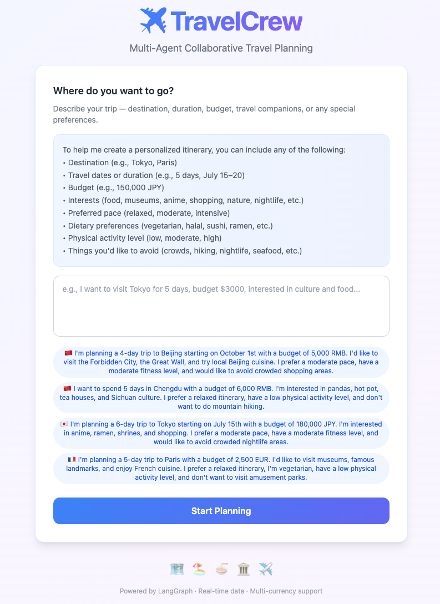
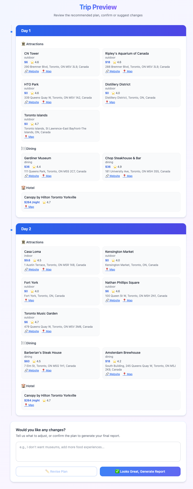
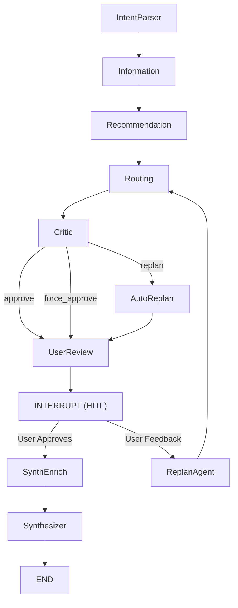

<p align="center">
  
</p>

<p align="center">
  
  
  
  
  
</p>

> **A controllable multi-stage travel planning system built on LangGraph — combining deterministic workflows with autonomous tool-using agents to produce verifiable and revisable travel itineraries.**

---

## Table of Contents

- [Overview](#overview)
- [Quick Start](#quick-start)
- [Example Walkthrough](#example-walkthrough)
- [System Architecture](#system-architecture)
- [From Query to Report: The Complete Pipeline](#from-query-to-report-the-complete-pipeline)
- [ReplanAgent: Autonomous Itinerary Revision](#replanagent-autonomous-itinerary-revision)
- [Key Features](#key-features)
- [Evaluation](#evaluation)
- [Project Structure](#project-structure)
- [Deployment Guide](#deployment-guide)
- [Web Interface](#web-interface)
- [API Endpoints](#api-endpoints)
- [Configuration](#configuration)
- [Tech Stack](#tech-stack)
- [License](#license)

---

## Overview

**TravelCrew** is a multi-stage LLM agent workflow built on [LangGraph](https://github.com/langchain-ai/langgraph). Rather than relying on a single monolithic LLM call, it decomposes travel planning into a **controllable pipeline** of deterministic workflow stages and autonomous agents — each addressing a specific challenge:

- **Data Layer** — fetch POIs, weather, hotels, and travel tips from 7+ real-time APIs in parallel; zero hallucinated data
- **Planning Layer** — rule-based pre-filtering + LLM daily-structured scoring with anti-hallucination safeguards
- **Verification Layer** — 11-rule Critic engine that catches budget, geographic, and feasibility issues before the user ever sees the plan
- **Autonomous ReplanAgent** — a tool-use agent with 12 tools that iteratively revises the plan (search new POIs, swap attractions, rebalance budget) — the system's most powerful component
- **Human-in-the-Loop** — pause after the initial plan so users can provide feedback *before* the final report
- **Streaming Report** — token-by-token SSE delivery of a 9-section Markdown report with images, maps, and budget breakdown

### Why Not Just Use a Single LLM?

```
Traditional LLM Planning              TravelCrew
─────────────────────                 ──────────
                                      
User Query                            User Query
    │                                     │
    ▼                                     ▼
┌────────┐                         ┌─────────────────┐
│  LLM   │                         │  Data Layer     │ ← 7+ real APIs
│ (1 call)│                         │  Planning Layer │ ← scored & filtered
└────────┘                         │  Verification   │ ← 11-rule audit
    │                              └─────────────────┘
    ▼                                     │
  Plan ✗                                  ▼
  • No real data                   ┌─────────────────┐
  • No verification                │  Human Review   │ ← HITL interrupt
  • No revision                    └─────────────────┘
  • No tool use                           │
                                          ▼
                                   ┌─────────────────┐
                                   │  ReplanAgent    │ ← 12 tools, 20 iterations
                                   └─────────────────┘
                                          │
                                          ▼
                                   Verified Plan ✓
```

The key insight: **not every step needs an agent**. Data fetching, routing, and report assembly are deterministic workflows that should be reliable and predictable. Only tasks requiring judgment, iteration, and tool use (recommendation, replanning, quality audit) use LLM-powered agents. This hybrid design gives you the best of both worlds: **the reliability of a workflow engine with the flexibility of autonomous agents where it matters.**

---

## Quick Start

```bash
# Clone and install
git clone https://github.com/richardwang1236/TravelCrew.git
cd TravelCrew
python -m venv venv && source venv/bin/activate
pip install -r requirements.txt

# Configure API keys
cp .env.example .env
# Edit .env: set DEEPSEEK_API_KEY and GOOGLE_MAPS_API_KEY (required)

# Launch the web server
python -m uvicorn server.app:app --host 0.0.0.0 --port 8000
```

Open **http://localhost:8000** and start planning! See [Deployment Guide](#deployment-guide) for full setup details and production tips.

---

## Example Walkthrough

Below is a step-by-step demonstration of a typical planning session.

**Step 1: Submit a Query**
On the front page, the user enters a natural-language travel request:
> "I want to visit Toronto for 2 days, I prefer outdoor activities, I want to eat steak."



**Step 2: Initial Plan**
After the pipeline runs (Intent Parsing → Data Fetching → Recommendation → Critic), the system presents an initial itinerary. Notice that the attractions are mostly outdoor and the dining options are steak-related — the agent correctly captured the user's intent.


**Step 3: User Feedback & ReplanAgent**
The user is not fully satisfied and provides feedback:
> "I want to go to Toronto Island, also I want a better hotel."

The ReplanAgent kicks in and iteratively modifies the plan. The session log records the exact changes:

```
╔════════════════════════════════════════════════════════════
║ 📊 ITINERARY_CHANGES                           2026-07-16 11:57:59
╠════════════════════════════════════════════════════════════
║ Day 1:
║   ➖ Attractions: St. Lawrence Market
║   ➕ Attractions: Toronto Islands
║   🏨 Hotel: One King West → Canopy by Hilton Toronto Yorkville
║ Day 2:
║   🏨 Hotel: One King West → Canopy by Hilton Toronto Yorkville
╚════════════════════════════════════════════════════════════
```



**Step 4: Final Report**
The user approves the revised plan, and the Synthesizer generates a comprehensive Markdown report with images, maps, budget breakdown, and travel tips.

> 📄 [View the generated report](media/Toronto_Plan.md)

## System Architecture

The system is orchestrated as a LangGraph state machine that combines **deterministic workflow nodes** (for data fetching, routing, report assembly) with **autonomous agent nodes** (for recommendation, replanning, quality audit). Conditional edges enable the ReplanAgent loop and a human-in-the-loop interrupt point.

### Workflow Diagram



### Node Roles & Data Flow

All nodes communicate through a central `TravelState` TypedDict. Each node reads from state, processes, and writes back. Nodes are grouped into four layers:

| Layer | # | Node | What It Does | Input | Output |
|-------|---|------|-------------|-------|--------|
| **Data** | 1 | **IntentParser** | Parse user query into structured intent | `query` | `intent`, `user_preferences` |
| **Data** | 2 | **Information** | Fetch real-time data from 4 APIs in parallel | `intent` | `raw_knowledge` — weather, POIs, hotels, Wikivoyage |
| **Planning** | 3 | **Recommendation** | Rule-based pre-filtering + LLM daily scoring | `raw_knowledge`, `intent` | `daily_itinerary`, `recommended_pois` |
| **Workflow** | 4 | **UserReview** | Pre-compute display fields, translate POI names | `daily_itinerary` | `exchange_rate`, `currency_symbol`, `is_chinese` |
| **Workflow** | 5 | **Routing** | Transport matrix, coordinate backfill | `recommended_pois` | `transport_matrix`, `routing_metrics` |
| **Verification** | 6 | **Critic** | 11-rule quality audit; triggers AutoReplan | `daily_itinerary`, `routing_metrics` | `audit_findings`, `replan_count` |
| **Agent** | 7 | **AutoReplan** | ReplanAgent tool-use loop to fix issues | `daily_itinerary`, `audit_findings` | Modified `daily_itinerary` |
| **Workflow** | 8 | **SynthEnrich** | Enrich with images, static maps, AI descriptions | `daily_itinerary` | Enriched itinerary (`image_url`, `static_map_url`) |
| **Workflow** | 9 | **Synthesizer** | Generate 9-section Markdown report (streaming) | Enriched itinerary + all state | `final_itinerary` |

> **Design principle**: Only nodes that require judgment, iteration, or tool use (Recommendation, Critic, ReplanAgent) are LLM-powered agents. The rest are deterministic workflow steps — predictable, testable, and fast.

## From Query to Report: The Complete Pipeline

The system transforms a natural-language travel request into a comprehensive Markdown report through a 4-stage pipeline:

### Stage 1: Intent Parsing & Data Collection

**IntentParser** extracts structured fields from the user's natural-language query: destination, duration, budget (with automatic currency detection and USD conversion), pacing, dietary preferences, group type, must-visit places, and interests.

**Information** then fetches real-time data from 4 external APIs in parallel via `ThreadPoolExecutor`:

| API | Data Retrieved |
|-----|----------------|
| Google Places (AI Mode + Text Search + Nearby Search) | Attractions, restaurants, hotels |
| Google Weather | Multi-day forecasts + severe weather alerts |
| Hotel Search (SerpApi) | Hotels filtered by per-night budget |
| Wikivoyage | Destination customs, safety, transport tips |

### Stage 2: Recommendation & Quality Audit

The **Recommendation** node (Planning Layer) applies a two-phase scoring pipeline (see [Node Roles table](#node-roles--data-flow) for I/O details):
1. **Rule-based pre-filtering** — weather conflicts, budget ceiling, must-avoid places
2. **LLM daily-structured scoring** — theme match (40%), budget fit (30%), rating (20%), time feasibility (10%)

An **anti-hallucination filter** strips any POIs the LLM fabricated that aren't in the real API data.

The **Critic** (Verification Layer) then audits the itinerary across 11 dimensions (budget, weather, geography, theme coverage, etc.). If issues are found, **AutoReplan** invokes the ReplanAgent tool-use loop to fix them automatically.

### Stage 3: Human-in-the-Loop Feedback Loop

At the interrupt point, the user sees a day-by-day itinerary review screen. The feedback cycle:

1. **User provides feedback** (e.g., "Replace the museum on Day 2 with a shopping mall")
2. **ReplanAgent** runs autonomously (up to 20 tool-call iterations) — inspects plan, searches new POIs, modifies itinerary, checks constraints
3. **Modified itinerary** is injected back into the graph
4. **Graph re-streams** through Routing → Critic (force-approve) → UserReview → INTERRUPT again
5. **Repeat** until the user is satisfied (empty input = approve)

### Stage 4: Report Generation

**SynthEnrich** enriches the confirmed itinerary with:
- POI cover images (Serper.dev, with geographic disambiguation)
- Static route maps (Google Static Maps, cached locally)
- POI name translations and AI-generated descriptions

**Synthesizer** assembles all data into a 9-section Markdown report:

| Section | Content |
|---------|----------|
| 1. Trip Overview | Title, dates, budget summary, transport plan |
| 2. Pre-Trip Prep | Packing list, local policies, travel tips |
| 3. Accommodation | Hotel cards with images and prices |
| 4. Daily Itinerary | Hour-by-hour schedule with transit, costs, highlights |
| 5. Food Guide | Categorized restaurant table with signature dishes |
| 6. Experiences | Optional activities at confirmed POIs |
| 7. Safety Guide | Tourist traps, scams, weather, emergency info |
| 8. Alternatives | Condensed / relaxed / rainy-day variants |
| 9. Summary | Trip highlights and travel advice |

The report is **streamed token-by-token via SSE** for real-time rendering on the frontend.

---

## ReplanAgent: Autonomous Itinerary Revision

The **ReplanAgent** is the system's most technically distinctive component — a fully autonomous tool-use agent that replaces traditional single-LLM-call replanning. It is the only true **agent** in the system: it reasons, acts, observes, and iterates — up to 20 rounds — until the itinerary satisfies all constraints.

### Why a Dedicated Agent?

In most LLM applications, "replanning" means sending the user's feedback as a new prompt and hoping the LLM gets it right in one shot. This approach has fundamental limitations:

| Problem | Single LLM Call | ReplanAgent |
|---------|----------------|-------------|
| Cannot discover new POIs | Fixed to existing data | Calls `search_place` in real-time |
| No self-verification | Trusts its own output | Runs `check_constraints` before finalizing |
| One-shot (may miss issues) | No iteration | Up to 20 iterative refinement rounds |
| Scope drift (changes unrelated items) | No guardrails | System prompt enforces targeted fixes only |
| No budget feedback | Cannot rebalance | Detects surplus/deficit and adjusts |

### Architecture: Reason → Act → Observe Loop

```
User Feedback + Current State
       │
       ▼
┌─────────────────────┐
│   ReplanAgent.run() │
│                     │
│  ┌── LLM ◄──────┐   │
│  │   │          │   │
│  │   ▼          │   │
│  │ Tool Call    │   │
│  │   │          │   │
│  │   ▼          │   │
│  │ Execute Tool │   │
│  │   │          │   │
│  └──►Result ────┘   │
│      (loop until    │
│       finalize)     │
└─────────────────────┘
       │
       ▼
Modified itinerary + prefs + new POIs
```

### Live Execution Trace

Here is an actual execution trace when a user requests: *"Replace St. Lawrence Market with Toronto Islands, and find a better hotel."*

```
Iteration 1 ─ REASON
  LLM: "User wants to swap an attraction and upgrade the hotel.
        I need to first inspect the current plan to understand
        which day has St. Lawrence Market, then search for Toronto Islands."
  → call: get_current_plan()
  ← result: Day 1 has St. Lawrence Market; budget has $120 surplus

Iteration 2 ─ ACT (parallel)
  → call: search_place("Toronto Islands")         ← POI found, added to pool
  → call: search_hotel(budget_range=[150, 250])   ← 3 hotels returned
  (parallel execution: 2 workers, ~1.2s total)

Iteration 3 ─ MODIFY
  LLM: "Toronto Islands fits Day 1 afternoon. Canopy by Hilton
        at $189/night fits budget. Replacing now."
  → call: modify_plan(day=1, remove="St. Lawrence Market", add="Toronto Islands")
  → call: modify_plan(hotel=Canopy by Hilton, all_days=true)

Iteration 4 ─ VERIFY
  → call: check_constraints()
  ← result: ✓ budget OK, ✓ must-visit covered, ✓ structure valid

Iteration 5 ─ FINALIZE
  → call: finalize(summary="Day 1: St. Lawrence Market → Toronto Islands;
        Hotel: upgraded to Canopy by Hilton across all days")
```

Total: **5 iterations, 6 tool calls, ~4 seconds** — the agent reasoned about scope, searched real APIs, modified the plan, verified constraints, and only then declared completion.

### Available Tools (12 tools)

| Tool | Purpose |
|------|--------|
| `get_current_plan` | View the full itinerary, preferences, budget, and geographic clusters |
| `get_poi_pool` | Browse available attractions, restaurants, and hotels |
| `search_place` | Search Google Places for specific places (adds to POI pool) |
| `search_hotel` | Search hotels with price range filters |
| `check_weather` | View weather forecast and alerts |
| `get_destination_info` | Read Wikivoyage travel knowledge |
| `discover_places` | AI-powered place discovery via SerpApi AI Mode |
| `check_transit` | Query the pre-computed transport matrix |
| `modify_plan` | Add/remove/swap attractions, dining, hotels; reorder |
| `check_constraints` | Validate budget, structure, must-visit coverage |
| `update_preferences` | Modify user preferences (dietary, pacing, interests, etc.) |
| `finalize` | Signal completion with a change summary |

### Smart Execution Strategies

- **Parallel read-only tools**: Search and inspect calls run concurrently (up to 6 workers) for 2–3× speedup
- **Search-loop detection**: If the agent makes 5+ search calls without modifying, a warning is injected to force action
- **Iteration budgeting**: Urgency warnings at `max_iterations - 3`, forced finalize at `max_iterations - 1`
- **Budget rebalancing**: The agent detects budget surplus and proactively upgrades dining/attractions
- **Geographic awareness**: Pre-computed cluster data prevents mixing distant POIs into the same day
- **Scope enforcement**: The system prompt instructs the agent to only modify items related to the user's feedback — preventing unintended changes to unrelated days or POIs

---

## Key Features

### Real-Time External Data
No hallucinated data — every POI, hotel, weather forecast, and travel tip comes from real APIs:
- **Google Places API** — attractions, restaurants, hotels (parallel search with AI Mode enhancement)
- **Google Distance Matrix API** — inter-attraction transit times
- **Google Geocoding API** — coordinate backfill for POIs
- **Google Weather API** — multi-day forecasts and severe weather alerts
- **Wikivoyage API** — destination-level travel knowledge (customs, safety, transport tips)
- **SerpApi** — Google AI Mode search for must-visit place discovery
- **Serper.dev** — Google Images search for POI cover images

### Anti-Hallucination Safeguards
Three layers of protection ensure report accuracy:
1. **POI Verification** — the Recommendation node strips any LLM-fabricated POIs not present in the real API data pool
2. **Price Backfill** — the Synthesizer enforces pre-computed prices from API data; no invented costs
3. **Data-Source Constraints** — the LLM prompt restricts output to only facts present in the provided data

### Streaming Report Generation
The Synthesizer streams the final Markdown report token-by-token via SSE. The frontend renders the report incrementally with:
- Zero-flicker incremental DOM updates (only the report body is re-rendered)
- Automatic scroll-to-bottom as content grows
- Real-time character count display

### Smart Budget Management
- Automatic currency detection from the user's query or destination
- Live exchange rate fetching (with static fallback rates for 6 currencies)
- Per-day budget breakdown: tickets, dining, transit, accommodation
- Destination-specific cost multipliers (50+ cities) and transit cost estimation

### Parallel API Execution
POI search uses three-level parallelization for maximum throughput:
1. **Stage 1**: AI Mode search + Geocoding run concurrently
2. **Stage 2a**: Text Search queries for all AI-discovered places in parallel
3. **Stage 2b**: Nearby Search by category (attractions, restaurants, etc.) in parallel

---

## Evaluation

A core question for any LLM agent system is: **does the workflow actually produce better results than a single LLM call?** We designed a rigorous comparative evaluation to answer this.

### Methodology

| Component | Detail |
|-----------|--------|
| **Agent pipeline** | DeepSeek V4 Flash (same model as baselines) |
| **Judge** | Gemini 3.1 Pro (independent, not used in the pipeline) |
| **Baselines** | DeepSeek V4 Flash, DeepSeek V4 Pro (single-call, same prompts) |
| **Queries** | Diverse trip-planning tasks covering destinations worldwide |
| **Anti-bias** | Pairwise presentation order randomized; judge does not know which plan is from the pipeline |

> **Why an independent LLM judge?** Human evaluation is the gold standard but prohibitively expensive at scale. We use Gemini 3.1 Pro — a model *not used anywhere in the pipeline* — as an independent evaluator. To mitigate known LLM-as-Judge biases (verbosity, position, self-preference), we employ two complementary methods and cross-validate their conclusions.

All models receive identical travel-planning queries. The generated itineraries are evaluated using 10 criteria (see below) across two complementary methods:

1. **Absolute Rating** — measures overall quality per plan
2. **Pairwise Comparison** — directly measures relative advantage

### Evaluation Criteria

Each itinerary is scored on a **1–10 scale** across 10 dimensions that span both **structural correctness** (objective) and **user experience** (subjective):

| # | Criterion | Key Question |
|---|-----------|-------------|
| 1 | **Constraint Satisfaction** | Does it satisfy all explicit requirements? (destination, dates, budget, preferences, accessibility, etc.) A 15% budget overrun is acceptable. |
| 2 | **Completeness** | Does it provide a full day-by-day schedule with per-POI details (opening hours, visit duration, map links, prices)? |
| 3 | **Personalization** | Are attractions, restaurants, hotels, and activities well-matched to the user's preferences and travel style? |
| 4 | **Practical Feasibility** | Is the itinerary realistically executable considering travel time, opening hours, pacing, and logistics? |
| 5 | **Budget Reasonableness** | Are costs realistic and internally consistent? Only heavily penalize absurd prices or >20% overruns. |
| 6 | **Geographic Coherence** | Are attractions geographically clustered to minimize unnecessary travel? |
| 7 | **Information Richness** | Does it include weather, transport tips, cultural advice, opening hours, booking tips, per-POI tips? |
| 8 | **Presentation Quality** | Is it visually appealing with tables, images, maps, icons, and good formatting? |
| 9 | **Language Quality** | Is the report fluent, grammatically correct, and in the user's requested language? |
| 10 | **Overall Experience** | How satisfying, enjoyable, and useful would this itinerary be for a real traveler? |

### Judging Methods

We experimented with two LLM-as-Judge approaches:

**1. Absolute Rating** — The judge evaluates one plan at a time and assigns an integer score (1–10) per criterion.

**2. Pairwise Comparison** — The judge receives two plans (Plan X & Plan Y) for the same query and picks the winner. To minimize positional bias, the presentation order is randomized.

<details>
<summary><b>Click to expand: Judge Prompts</b></summary>

#### Absolute Rating Prompt

```text
You are an expert travel-plan evaluator with years of experience
reviewing itineraries for real travelers. Your evaluations are
trusted for their fairness, thoroughness, and calibration.

[RUBRIC — 10 criteria listed above]

EVALUATION PROTOCOL:
1. Read the ENTIRE itinerary carefully before scoring.
2. For each criterion, think step by step: what does the plan do
   well? Where does it fall short?
3. Assign an integer score (1-10).
4. Be consistent — similar quality across reports should receive
   similar scores.
5. Use the short label (e.g. "Constraint satisfaction") as the key.

Return JSON: {criterion_label: score, ..., "average": mean,
"reasoning": "1-2 sentence summary"}
```

#### Pairwise Comparison Prompt

```text
You are an impartial travel-plan judge. Compare two itineraries
(Plan_X and Plan_Y) created for the SAME travel query.

ANTI-BIAS RULES:
- Read and evaluate Plan_X COMPLETELY before reading Plan_Y.
- Then read Plan_Y with EQUAL attention and scrutiny.
- Presentation order MUST NOT influence your judgment.
- If truly comparable, declare a 'tie'.
- Base your decision on CRITERIA, not length or verbosity.

EVALUATION PROTOCOL:
1. Score Plan_X on EACH criterion (1-10).
2. Score Plan_Y on EACH criterion (1-10).
3. Compare scores side by side.
4. Determine which plan wins on more criteria.
5. If one plan dominates (≥60% of criteria), declare it the winner.
6. Otherwise, declare a tie.

Return JSON: {"winner": "Plan_X"|"Plan_Y"|"tie",
"reason": "...", "scores": {"Plan_X": {...}, "Plan_Y": {...}}}
```

</details>

### Evaluation Results

#### Absolute Rating

We evaluated plans across diverse destinations (short trips and multi-day itineraries worldwide). Each model received the same queries and was scored on a 1–10 scale per criterion.

**Overall Ranking:**

| Model | Plans | Average | Rank |
|-------|:-----:|:-------:|:----:|
| **Agent Pipeline** | 30 | **9.10** | #1 🏆 |
| DeepSeek V4 Pro | 30 | 9.05 | #2 |
| DeepSeek V4 Flash | 30 | 8.60 | #3 |

**Key Strengths of Agent Pipeline:**

The multi-stage workflow delivers decisive advantages in dimensions where **real-time data and structured workflows** matter most:

| Advantage | Agent Pipeline | DeepSeek V4 Flash | DeepSeek V4 Pro | Δ vs Best Baseline |
|-----------|:--------------:|:--------:|:------:|:------------------:|
| **Presentation Quality** | **10.00** | 7.75 | 8.25 | **+2.25** |
| **Information Richness** | **10.00** | 8.50 | 9.00 | **+1.00** |
| **Completeness** | **8.75** | 7.00 | 7.50 | **+1.25** |

> *Personalization and Language Quality scored equally across all models (≥9.5 and 10.0 respectively), so they are omitted from the advantage table.*

**Where the advantages come from:**

| Dimension | What Causes the Gap |
|-----------|--------------------|
| **Presentation +2.25** | Synthesizer node produces professionally formatted 9-section reports with images, maps, and tables — impossible for a single LLM call |
| **Information Richness +1.00** | 7+ real-time APIs provide weather, transit, hotel prices, and Wikivoyage tips that a standalone LLM must hallucinate |
| **Completeness +1.25** | The Planning Layer's day-by-day scoring ensures every day has timed POIs, costs, and transit — single LLM calls often skip details |

#### Pairwise Comparison

In head-to-head evaluations, the judge received two anonymized plans for the same query and selected the winner based on the 10 criteria (presentation order randomized to eliminate positional bias).

| Matchup | Wins | Ties | Losses | Win Rate |
|---------|:----:|:----:|:------:|:--------:|
| **Agent Pipeline** vs V4 Flash | **9** | 1 | 0 | 90.0% |
| **Agent Pipeline** vs V4 Pro | **8** | 2 | 0 | 80.0% |

> The Agent Pipeline **never lost** a pairwise comparison. Wins were primarily driven by superior presentation quality (images, maps, tables), information richness (real-time API data, weather, transport tips), and completeness (per-POI timing, costs, map links). Ties occurred in scenarios where baselines produced more geographically compact routes for simpler single-city trips.

---

## Project Structure

```
TravelCrew/
├── main.py                          # CLI entry point (interactive terminal mode)
├── requirements.txt                 # Python dependencies
├── package.json                     # Tailwind CSS build config (optional)
├── .env.example                     # Environment variable template
├── LICENSE                          # MIT License
│
├── src/                             # Core application logic
│   ├── graph.py                     # LangGraph workflow definition & compilation
│   ├── state.py                     # TravelState TypedDict (shared state schema)
│   ├── config.py                    # Centralized configuration (LLM, API keys, constants)
│   ├── llm.py                       # LLM client (DeepSeek via OpenAI-compatible SDK)
│   │
│   ├── agents/                      # Agent node implementations
│   │   ├── intent_parser.py         # IntentParser -- parse user query into structured intent
│   │   ├── information.py           # Information -- parallel API data fetching
│   │   ├── recommendation.py        # Recommendation -- LLM-driven itinerary generation
│   │   ├── user_review.py           # UserReview -- pre-compute display fields for HITL
│   │   ├── routing.py               # Routing -- transport matrix & coordinate backfill
│   │   ├── critic.py                # Critic -- 11-rule quality audit & replan trigger
│   │   ├── synthesizer.py           # SynthEnrich + Synthesizer -- enrichment & report generation
│   │   ├── auto_replan.py           # AutoReplan -- critic-triggered autonomous replan
│   │   ├── replan_agent.py          # ReplanAgent -- tool-use agent for itinerary revision
│   │   └── utils.py                 # Shared helpers (LLM client, progress, currency)
│   │
│   └── api/                         # External API client modules
│       ├── base.py                  # Base HTTP client with retry logic
│       ├── ai_search.py             # SerpApi Google AI Mode search
│       ├── attractions.py           # Google Places POI search (parallel 3-stage)
│       ├── hotels.py                # Hotel search API
│       ├── images.py                # Serper.dev image search (3-tier fallback)
│       ├── transport.py             # Google Distance Matrix API
│       ├── geocoding.py             # Google Geocoding API (coordinate backfill)
│       ├── static_map.py            # Google Static Maps generation & caching
│       ├── weather.py               # Google Weather API integration
│       └── wikivoyage.py            # Wikivoyage / Wikimedia Enterprise API
│
├── server/                          # FastAPI web server
│   ├── app.py                       # FastAPI application & API endpoints
│   ├── schemas.py                   # Pydantic request/response models
│   ├── session_manager.py           # Session lifecycle management (TTL, concurrency)
│   └── streaming.py                 # SSE streaming with cross-thread context propagation
│
├── frontend/                        # Pure HTML/JS/CSS single-page application
│   ├── index.html                   # Main HTML page
│   ├── css/style.css                # Application styles
│   └── js/
│       ├── app.js                   # Main application logic & state machine
│       ├── api.js                   # API client functions
│       ├── components.js            # UI component renderers
│       ├── sse.js                   # SSE event handler
│       └── i18n.js                  # Internationalization (Chinese/English)
│
├── reports/                         # Generated reports — {session_id}.md and {session_id}.html
├── log/                             # Per-session activity logs — {session_id}.log
└── output/                          # CLI-mode generated reports
```

---

## Deployment Guide

### Prerequisites

- **Python 3.10+** (recommended: 3.12 or 3.13)
- **Node.js 18+** (optional, only for Tailwind CSS rebuilds)
- **API Keys** (see [.env.example](.env.example)):
  - DeepSeek API key (LLM backend) — **required**
  - Google Maps API key (Places, Distance Matrix, Geocoding, Weather, Static Maps) — **required**
  - SerpApi key (AI Mode search) — optional
  - Serper.dev key (image search) — optional
  - OpenWeatherMap key (fallback weather) — optional
  - Wikimedia Enterprise (Wikivoyage articles) — optional

### Step-by-Step Setup on a New Machine

```bash
# 1. Clone the repository
git clone https://github.com/richardwang1236/TravelCrew.git
cd TravelCrew

# 2. Create and activate a Python virtual environment
python -m venv venv
source venv/bin/activate   # macOS/Linux
# venv\Scripts\activate    # Windows

# 3. Install Python dependencies
pip install -r requirements.txt

# 4. Configure environment variables
cp .env.example .env
# Edit .env with your actual API keys:
#   - DEEPSEEK_API_KEY (required)
#   - GOOGLE_MAPS_API_KEY (required)
#   - SERPAPI_KEY, SERPER_API_KEY, etc. (optional)

# 5. (Optional) Install Node.js dependencies for Tailwind CSS rebuilds
npm install

# 6. (Optional) Rebuild Tailwind CSS if you modified frontend styles
npm run build:css
```

### Running the Application

#### Web Mode (Recommended)

```bash
python -m uvicorn server.app:app --host 0.0.0.0 --port 8000
```

Open **http://localhost:8000** in your browser.

#### CLI Mode (Interactive Terminal)

```bash
python main.py
```

### Production Deployment Tips

- **Reverse Proxy**: Use Nginx or Caddy to proxy requests to `localhost:8000` with HTTPS
- **Process Manager**: Run with `gunicorn` or `uvicorn --workers 4` for multi-process serving
- **Environment**: Set `SESSION_TTL_SECONDS` and `MAX_CONCURRENT_SESSIONS` based on expected load
- **Static Files**: The frontend is served directly by FastAPI — no separate web server needed
- **Reports**: Generated reports are persisted in `reports/` as `.md` and standalone `.html` files
- **Logs**: Per-session activity logs are saved in `log/{session_id}.log` for debugging

### Verifying the Setup

After starting the server, verify everything works:

```bash
# Health check
curl http://localhost:8000/health
# Expected: {"status":"ok","service":"travel-planning-agent"}

# Create a session and submit a query via the web UI at http://localhost:8000
```

---

## Web Interface

The web frontend is a lightweight single-page application (pure HTML/JS/CSS — no build step required):

| Feature | Description |
|---|---|
| **Natural Language Input** | Describe your trip in plain Chinese or English |
| **Real-Time Progress** | SSE streaming with live progress bar, elapsed timer, and node-by-node status |
| **Streaming Report** | Watch the Markdown report generate in real-time with incremental rendering |
| **Itinerary Preview** | Day-by-day breakdown with currency-converted costs |
| **Feedback & Revision** | Submit modifications; the ReplanAgent autonomously revises the plan |
| **Report Download** | Export the report as PDF via browser print or server-side WeasyPrint |
| **Share Link** | Generate a standalone HTML share link (`/share/{session_id}`) |
| **Language Toggle** | Switch between Chinese and English (persisted in localStorage) |
| **Collapsible Maps** | Google Static Maps are collapsed by default, expanded for printing |

---

## API Endpoints

| Method | Endpoint | Description |
|--------|----------|-------------|
| `GET` | `/health` | Health check |
| `POST` | `/api/sessions` | Create a new planning session |
| `POST` | `/api/sessions/{id}/plan` | Submit a travel query (Phase 1) |
| `GET` | `/api/sessions/{id}/stream` | **SSE** — real-time event streaming |
| `GET` | `/api/sessions/{id}/state` | Current session state snapshot |
| `POST` | `/api/sessions/{id}/feedback` | Submit feedback → triggers ReplanAgent |
| `POST` | `/api/sessions/{id}/confirm` | Confirm plan and start Phase 2 |
| `GET` | `/api/sessions/{id}/report` | Get the final report (Markdown) |
| `GET` | `/api/sessions/{id}/download` | Download report as PDF |
| `GET` | `/share/{id}` | View shareable HTML report |

### SSE Event Types

| Event | Description |
|---|---|
| `node_completed` | A graph node finished execution |
| `progress_log` | Localized progress message from a node |
| `interrupt` | Graph paused at HITL checkpoint (includes display data) |
| `markdown_chunk` | Streaming Markdown token from Synthesizer |
| `execution_complete` | Graph completed (includes final report) |
| `error` | An error occurred |
| `timeout` | Stream timed out |

---

## Configuration

All configuration is centralized in `src/config.py` and loaded from environment variables. See [.env.example](.env.example) for the full list.

### LLM Configuration

| Variable | Default | Description |
|----------|---------|-------------|
| `DEEPSEEK_API_KEY` | *(empty)* | DeepSeek API key |
| `DEEPSEEK_BASE_URL` | `https://api.deepseek.com` | LLM API base URL |
| `DEEPSEEK_MODEL` | `deepseek-v4-flash` | Model identifier |
| `LLM_TIMEOUT` | `300.0` | Per-request timeout (seconds) |
| `LLM_MAX_RETRIES` | `3` | Max retry attempts |

### External API Keys

| Variable | Description |
|----------|-------------|
| `GOOGLE_MAPS_API_KEY` | Google Places, Distance Matrix, Geocoding, Weather, Static Maps |
| `SERPAPI_KEY` | SerpApi Google AI Mode search |
| `SERPER_API_KEY` | Serper.dev Google Images search |
| `OPENWEATHER_API_KEY` | OpenWeatherMap (optional fallback) |

### Business Logic

| Variable | Default | Description |
|----------|---------|-------------|
| `MAX_REPLAN_ATTEMPTS` | `3` | Max Critic-triggered auto-replans |
| `PLACES_SEARCH_RADIUS` | `5000` | Google Places search radius (meters) |
| `PLACES_RESULT_LIMIT` | `30` | Max POI results per query |

### Web Server

| Variable | Default | Description |
|----------|---------|-------------|
| `API_HOST` | `0.0.0.0` | FastAPI bind address |
| `API_PORT` | `8000` | FastAPI port |
| `SESSION_TTL_SECONDS` | `3600` | Session time-to-live |
| `MAX_CONCURRENT_SESSIONS` | `10` | Max concurrent sessions |

---

## Tech Stack

### Backend

| Technology | Purpose |
|---|---|
| Python 3.10+ | Core language |
| LangGraph | State machine orchestration — deterministic workflow + autonomous agent nodes |
| DeepSeek | LLM inference via OpenAI-compatible SDK |
| FastAPI | Web API framework & SSE streaming |
| Uvicorn | ASGI server |
| Pydantic | Request/response validation |
| WeasyPrint | Server-side PDF generation |

### External APIs

| API | Purpose |
|---|---|
| Google Places API | Attractions, restaurants, hotels |
| Google Distance Matrix API | Transit time estimation |
| Google Geocoding API | Coordinate backfill |
| Google Weather API | Forecasts & severe weather alerts |
| Google Static Maps | Route visualization maps |
| SerpApi | AI Mode search for must-visit discovery |
| Serper.dev | Google Images search |
| Wikivoyage / Wikimedia | Destination travel knowledge |

### Frontend

| Technology | Purpose |
|---|---|
| HTML5 + Vanilla JS (ES Modules) | SPA without build tools |
| CSS3 | Responsive styling with gradient animations |
| Server-Sent Events (SSE) | Real-time progress & streaming report |
| marked.js (v4.3.0) | Client-side Markdown rendering |

---

## License

This project is licensed under the [MIT License](LICENSE).

---

<p align="center">
  <em>Deterministic Workflows · Autonomous Agents · Real APIs · Built with LangGraph</em>
</p>
